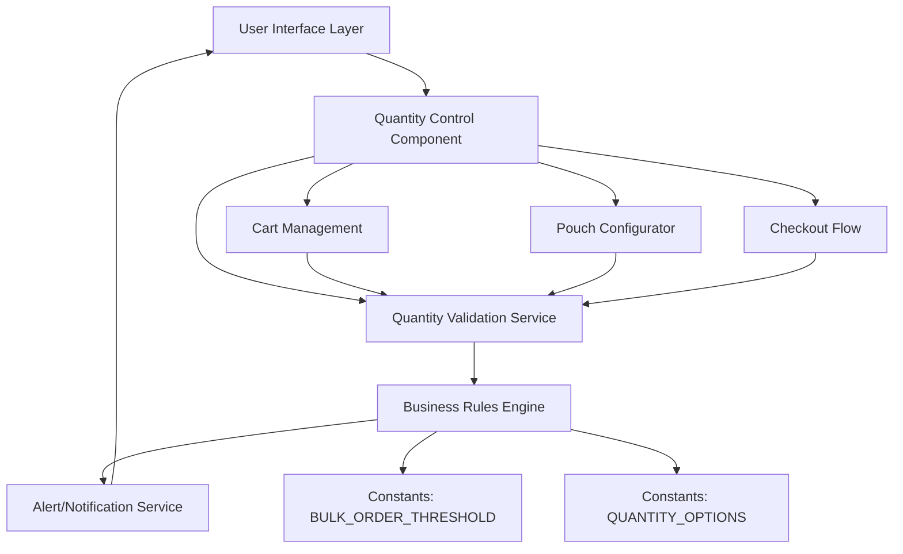
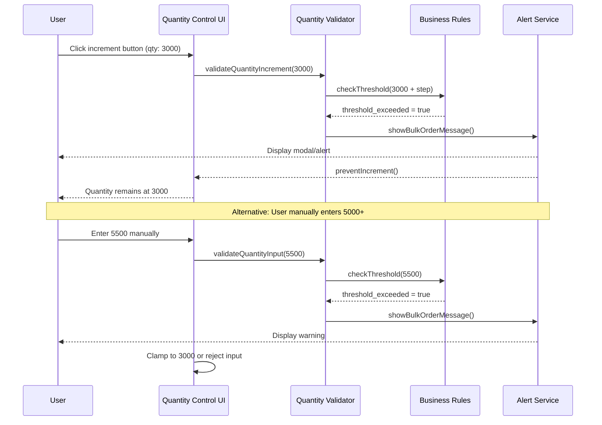

# Design Document: Quantity Validation for Orders ≥ 5,000 Units

## Overview

This feature implements consistent quantity validation across all order entry points in the application. When users attempt to order 5,000 units or more, the system displays a clear message directing them to contact the sales team for special pricing and arrangements. The validation prevents increment actions that would result in quantities >= 5,000 while maintaining a user-friendly experience with clear communication about bulk order requirements.

The feature addresses the business rule that large orders (5,000+ units) require manual processing by the sales team and cannot be processed through the standard e-commerce flow. This ensures proper handling of bulk orders while maintaining the self-service experience for standard quantities.

## Architecture



## Main Algorithm/Workflow




## Components and Interfaces

### Component 1: QuantityValidator

**Purpose**: Centralized validation logic for quantity thresholds across all order entry points

**Interface**:
```typescript
interface QuantityValidator {
  validateQuantityIncrement(currentQuantity: number, options: QuantityOptions): ValidationResult
  validateQuantityDecrement(currentQuantity: number, options: QuantityOptions): ValidationResult
  validateQuantityInput(inputQuantity: number, options: QuantityOptions): ValidationResult
  getBulkOrderMessage(): BulkOrderMessage
}


interface QuantityOptions {
  quantitySteps: number[]  // [100, 200, 300, 500, 1000, 3000, 5000]
  minimumOrderQuantity: number
  bulkOrderThreshold: number  // 5000
}

interface ValidationResult {
  isValid: boolean
  newQuantity: number | null
  shouldShowAlert: boolean
  alertType: 'bulk_order' | 'min_order' | null
  message: string | null
}

interface BulkOrderMessage {
  title: string
  message: string
  contactInfo: ContactInfo
}

interface ContactInfo {
  phone: string
  email: string
}
```

**Responsibilities**:
- Validate quantity changes against business rules
- Determine if bulk order threshold is exceeded
- Generate appropriate user messages
- Return validation results for UI consumption

### Component 2: QuantityControl

**Purpose**: Reusable UI component for quantity increment/decrement controls

**Interface**:
```typescript
interface QuantityControlProps {
  currentQuantity: number
  quantityOptions: number[]
  minimumOrderQuantity: number
  onQuantityChange: (newQuantity: number) => void
  onValidationError: (error: ValidationResult) => void
  disabled?: boolean
}
```


interface QuantityControl {
  render(): ReactElement
  handleIncrement(): void
  handleDecrement(): void
  handleManualInput(value: string): void
}
```

**Responsibilities**:
- Render increment/decrement buttons
- Handle user interactions
- Invoke validator before state changes
- Display validation errors to user
- Maintain accessible UI (keyboard navigation, screen reader support)

### Component 3: AlertService

**Purpose**: Display validation messages and bulk order notifications

**Interface**:
```typescript
interface AlertService {
  showBulkOrderAlert(message: BulkOrderMessage): Promise<void>
  showMinimumOrderAlert(minimumQuantity: number, onRemove?: () => void): Promise<void>
  showGenericAlert(title: string, message: string, buttons?: AlertButton[]): Promise<void>
}

interface AlertButton {
  text: string
  style?: 'default' | 'cancel' | 'destructive'
  onPress?: () => void
}
```

**Responsibilities**:
- Display native alerts (React Native Alert.alert)
- Format bulk order messages consistently
- Provide OK/Cancel actions where appropriate
- Handle platform differences (iOS vs Android)

## Data Models

### Model 1: ValidationConfiguration

```typescript
interface ValidationConfiguration {
  bulkOrderThreshold: number
  quantitySteps: number[]
  minimumOrderQuantity: number
  bulkOrderContactPhone: string
  bulkOrderContactEmail: string
}
```


**Validation Rules**:
- `bulkOrderThreshold` must be > 0
- `quantitySteps` must be sorted in ascending order
- `minimumOrderQuantity` must be <= smallest value in `quantitySteps`
- Contact phone and email must be non-empty strings
- `bulkOrderThreshold` should be present in `quantitySteps` array

**Default Values**:
```typescript
const DEFAULT_VALIDATION_CONFIG: ValidationConfiguration = {
  bulkOrderThreshold: 5000,
  quantitySteps: [100, 200, 300, 500, 1000, 3000, 5000],
  minimumOrderQuantity: 100,
  bulkOrderContactPhone: '+91 98765 43210',
  bulkOrderContactEmail: 'admin@packmonk.com'
}
```

### Model 2: QuantityChangeEvent

```typescript
interface QuantityChangeEvent {
  previousQuantity: number
  attemptedQuantity: number
  finalQuantity: number
  changeType: 'increment' | 'decrement' | 'manual_input'
  wasBlocked: boolean
  blockReason?: 'bulk_threshold' | 'min_order' | null
  timestamp: Date
  source: 'cart' | 'configurator' | 'checkout' | 'product_detail'
}
```

**Validation Rules**:
- `previousQuantity` must be >= 0
- `attemptedQuantity` must be >= 0
- `finalQuantity` must be >= minimumOrderQuantity
- If `wasBlocked` is true, `blockReason` must be non-null
- `timestamp` must be a valid Date object
- `source` must be one of the enumerated values

## Algorithmic Pseudocode

### Main Validation Algorithm

```typescript
/**
 * Validates quantity increment operations
 */

function validateQuantityIncrement(
  currentQuantity: number,
  options: QuantityOptions
): ValidationResult {
  // Precondition: currentQuantity >= 0
  // Precondition: options.quantitySteps is sorted ascending
  // Precondition: options.bulkOrderThreshold > 0
  
  // Find current index in quantity steps
  const currentIndex = options.quantitySteps.indexOf(currentQuantity)
  
  let nextQuantity: number
  
  if (currentIndex === -1) {
    // Current quantity not in steps, use first step
    nextQuantity = options.quantitySteps[0]
  } else if (currentIndex === options.quantitySteps.length - 1) {
    // Already at maximum step
    nextQuantity = currentQuantity
  } else {
    // Move to next step
    nextQuantity = options.quantitySteps[currentIndex + 1]
  }
  
  // Check bulk order threshold
  if (nextQuantity >= options.bulkOrderThreshold) {
    return {
      isValid: false,
      newQuantity: null,
      shouldShowAlert: true,
      alertType: 'bulk_order',
      message: 'For orders of 5,000 units and above, please contact our sales team for special pricing and arrangements.'
    }
  }
  
  // Valid increment
  return {
    isValid: true,
    newQuantity: nextQuantity,
    shouldShowAlert: false,
    alertType: null,
    message: null
  }
  
  // Postcondition: If isValid, newQuantity < bulkOrderThreshold
  // Postcondition: If !isValid && alertType === 'bulk_order', newQuantity is null
}
```

### Decrement Validation Algorithm

```typescript
/**
 * Validates quantity decrement operations
 */

function validateQuantityDecrement(
  currentQuantity: number,
  options: QuantityOptions
): ValidationResult {
  // Precondition: currentQuantity >= options.minimumOrderQuantity
  // Precondition: options.quantitySteps is sorted ascending
  
  const currentIndex = options.quantitySteps.indexOf(currentQuantity)
  
  let previousQuantity: number
  
  if (currentIndex === -1 || currentIndex === 0) {
    // At or below minimum step
    return {
      isValid: false,
      newQuantity: null,
      shouldShowAlert: true,
      alertType: 'min_order',
      message: `Minimum order quantity is ${options.minimumOrderQuantity} units.`
    }
  }
  
  // Move to previous step
  previousQuantity = options.quantitySteps[currentIndex - 1]
  
  // Ensure we don't go below minimum
  if (previousQuantity < options.minimumOrderQuantity) {
    return {
      isValid: false,
      newQuantity: null,
      shouldShowAlert: true,
      alertType: 'min_order',
      message: `Minimum order quantity is ${options.minimumOrderQuantity} units.`
    }
  }
  
  // Valid decrement
  return {
    isValid: true,
    newQuantity: previousQuantity,
    shouldShowAlert: false,
    alertType: null,
    message: null
  }
  
  // Postcondition: If isValid, newQuantity >= minimumOrderQuantity
  // Postcondition: If !isValid, newQuantity is null
}
```

### Manual Input Validation Algorithm

```typescript
/**
 * Validates manually entered quantity values
 */

function validateQuantityInput(
  inputQuantity: number,
  options: QuantityOptions
): ValidationResult {
  // Precondition: inputQuantity is a valid number (not NaN, not negative)
  // Precondition: options.bulkOrderThreshold > 0
  // Precondition: options.minimumOrderQuantity > 0
  
  // Check if input is non-positive
  if (inputQuantity <= 0) {
    return {
      isValid: false,
      newQuantity: options.minimumOrderQuantity,
      shouldShowAlert: true,
      alertType: 'min_order',
      message: `Quantity must be at least ${options.minimumOrderQuantity} units.`
    }
  }
  
  // Check bulk order threshold
  if (inputQuantity >= options.bulkOrderThreshold) {
    return {
      isValid: false,
      newQuantity: null,
      shouldShowAlert: true,
      alertType: 'bulk_order',
      message: 'For orders of 5,000 units and above, please contact our sales team for special pricing and arrangements.'
    }
  }
  
  // Check minimum order quantity
  if (inputQuantity < options.minimumOrderQuantity) {
    return {
      isValid: false,
      newQuantity: options.minimumOrderQuantity,
      shouldShowAlert: true,
      alertType: 'min_order',
      message: `Minimum order quantity is ${options.minimumOrderQuantity} units.`
    }
  }
  
  // Valid input - find nearest quantity step
  const nearestStep = findNearestQuantityStep(inputQuantity, options.quantitySteps)
  
  return {
    isValid: true,
    newQuantity: nearestStep,
    shouldShowAlert: false,
    alertType: null,
    message: null
  }
  
  // Postcondition: If isValid, minimumOrderQuantity <= newQuantity < bulkOrderThreshold
  // Postcondition: newQuantity is in quantitySteps array
}
```


### Helper Algorithm: Find Nearest Quantity Step

```typescript
/**
 * Finds the nearest valid quantity step for a given input
 */
function findNearestQuantityStep(
  inputQuantity: number,
  quantitySteps: number[]
): number {
  // Precondition: quantitySteps is sorted ascending
  // Precondition: quantitySteps.length > 0
  // Precondition: inputQuantity > 0
  
  let nearestStep = quantitySteps[0]
  let minDifference = Math.abs(inputQuantity - nearestStep)
  
  // Loop invariant: nearestStep is the closest step found so far
  // Loop invariant: minDifference = |inputQuantity - nearestStep|
  for (let i = 1; i < quantitySteps.length; i++) {
    const currentStep = quantitySteps[i]
    const difference = Math.abs(inputQuantity - currentStep)
    
    if (difference < minDifference) {
      nearestStep = currentStep
      minDifference = difference
    }
  }
  
  return nearestStep
  
  // Postcondition: nearestStep ∈ quantitySteps
  // Postcondition: ∀ step ∈ quantitySteps: |inputQuantity - nearestStep| <= |inputQuantity - step|
}
```

## Key Functions with Formal Specifications

### Function 1: validateQuantityIncrement()

```typescript
function validateQuantityIncrement(
  currentQuantity: number,
  options: QuantityOptions
): ValidationResult
```

**Preconditions:**
- `currentQuantity >= 0`
- `options.quantitySteps` is non-empty and sorted in ascending order
- `options.bulkOrderThreshold > 0`
- `options.minimumOrderQuantity > 0`

**Postconditions:**
- Returns `ValidationResult` object
- If `result.isValid === true`:
  - `result.newQuantity !== null`
  - `result.newQuantity < options.bulkOrderThreshold`

  - `result.newQuantity > currentQuantity` (quantity increased)
- If `result.isValid === false`:
  - `result.newQuantity === null`
  - `result.shouldShowAlert === true`
  - `result.alertType !== null`
- No side effects on input parameters

**Loop Invariants:** N/A (no loops in main function body)

### Function 2: validateQuantityDecrement()

```typescript
function validateQuantityDecrement(
  currentQuantity: number,
  options: QuantityOptions
): ValidationResult
```

**Preconditions:**
- `currentQuantity >= options.minimumOrderQuantity`
- `options.quantitySteps` is non-empty and sorted in ascending order
- `options.minimumOrderQuantity > 0`

**Postconditions:**
- Returns `ValidationResult` object
- If `result.isValid === true`:
  - `result.newQuantity !== null`
  - `result.newQuantity >= options.minimumOrderQuantity`
  - `result.newQuantity < currentQuantity` (quantity decreased)
- If `result.isValid === false`:
  - `result.newQuantity === null`
  - `result.shouldShowAlert === true`
  - `result.alertType === 'min_order'`
- No side effects on input parameters

**Loop Invariants:** N/A

### Function 3: validateQuantityInput()

```typescript
function validateQuantityInput(
  inputQuantity: number,
  options: QuantityOptions
): ValidationResult
```

**Preconditions:**
- `inputQuantity` is a valid number (not NaN)
- `options.quantitySteps` is non-empty and sorted in ascending order
- `options.bulkOrderThreshold > 0`
- `options.minimumOrderQuantity > 0`


**Postconditions:**
- Returns `ValidationResult` object
- If `result.isValid === true`:
  - `result.newQuantity !== null`
  - `options.minimumOrderQuantity <= result.newQuantity < options.bulkOrderThreshold`
  - `result.newQuantity ∈ options.quantitySteps`
- If `result.isValid === false` and `result.alertType === 'bulk_order'`:
  - `result.newQuantity === null`
  - Input quantity was >= bulkOrderThreshold
- If `result.isValid === false` and `result.alertType === 'min_order'`:
  - `result.newQuantity === options.minimumOrderQuantity`
  - Input quantity was < minimumOrderQuantity
- No side effects on input parameters

**Loop Invariants:** N/A

### Function 4: findNearestQuantityStep()

```typescript
function findNearestQuantityStep(
  inputQuantity: number,
  quantitySteps: number[]
): number
```

**Preconditions:**
- `quantitySteps.length > 0`
- `quantitySteps` is sorted in ascending order
- `inputQuantity > 0`

**Postconditions:**
- Returns a number from the `quantitySteps` array
- Returned value minimizes `|inputQuantity - step|` for all steps in array
- Return value `∈ quantitySteps`

**Loop Invariants:**
- For each iteration `i`, `nearestStep` contains the closest step found in `quantitySteps[0..i-1]`
- `minDifference === |inputQuantity - nearestStep|`
- `nearestStep ∈ quantitySteps[0..i-1]`

## Example Usage

### Example 1: Increment from 3000 (blocked by threshold)

```typescript
const config: ValidationConfiguration = {
  bulkOrderThreshold: 5000,
  quantitySteps: [100, 200, 300, 500, 1000, 3000, 5000],
  minimumOrderQuantity: 100,
  bulkOrderContactPhone: '+91 98765 43210',
  bulkOrderContactEmail: 'admin@packmonk.com'
}


const validator = new QuantityValidator(config)
const currentQuantity = 3000

// User clicks increment button
const result = validator.validateQuantityIncrement(currentQuantity, {
  quantitySteps: config.quantitySteps,
  minimumOrderQuantity: config.minimumOrderQuantity,
  bulkOrderThreshold: config.bulkOrderThreshold
})

// Result:
// {
//   isValid: false,
//   newQuantity: null,
//   shouldShowAlert: true,
//   alertType: 'bulk_order',
//   message: 'For orders of 5,000 units and above, please contact our sales team for special pricing and arrangements.'
// }

if (!result.isValid && result.shouldShowAlert) {
  Alert.alert('Bulk Order', result.message, [{ text: 'OK' }])
}
// Quantity remains at 3000
```

### Example 2: Decrement from 1000 to 500 (valid)

```typescript
const currentQuantity = 1000

const result = validator.validateQuantityDecrement(currentQuantity, {
  quantitySteps: config.quantitySteps,
  minimumOrderQuantity: config.minimumOrderQuantity,
  bulkOrderThreshold: config.bulkOrderThreshold
})

// Result:
// {
//   isValid: true,
//   newQuantity: 500,
//   shouldShowAlert: false,
//   alertType: null,
//   message: null
// }

if (result.isValid && result.newQuantity !== null) {
  setQuantity(result.newQuantity)
}
// Quantity updated to 500
```

### Example 3: Manual input of 6000 (blocked)

```typescript
const userInput = '6000'
const inputQuantity = parseInt(userInput, 10)

if (isNaN(inputQuantity)) {
  Alert.alert('Invalid Input', 'Please enter a valid number')
  return
}

const result = validator.validateQuantityInput(inputQuantity, {
  quantitySteps: config.quantitySteps,
  minimumOrderQuantity: config.minimumOrderQuantity,
  bulkOrderThreshold: config.bulkOrderThreshold
})

// Result:
// {
//   isValid: false,
//   newQuantity: null,
//   shouldShowAlert: true,
//   alertType: 'bulk_order',
//   message: 'For orders of 5,000 units and above, please contact our sales team...'
// }


if (!result.isValid && result.shouldShowAlert) {
  Alert.alert('Bulk Order', result.message, [{ text: 'OK' }])
}
// Input rejected, quantity unchanged
```

### Example 4: Integration with PouchConfiguratorScreen

```typescript
// In PouchConfiguratorScreen.tsx
const incrementQty = () => {
  const validator = new QuantityValidator(validationConfig)
  
  const result = validator.validateQuantityIncrement(config.quantity, {
    quantitySteps: QUANTITY_OPTIONS,
    minimumOrderQuantity: moq,
    bulkOrderThreshold: BULK_ORDER_THRESHOLD
  })
  
  if (!result.isValid && result.shouldShowAlert && result.alertType === 'bulk_order') {
    Alert.alert(
      'Bulk Order',
      result.message,
      [{ text: 'OK' }]
    )
    return
  }
  
  if (result.isValid && result.newQuantity !== null) {
    dispatch(setQuantity(result.newQuantity))
    setQtyInput(String(result.newQuantity))
  }
}
```

### Example 5: Integration with CartModal

```typescript
// In CartModal.tsx
const handleQty = (cartId: string, dir: 'inc' | 'dec', qty: number) => {
  const validator = new QuantityValidator(validationConfig)
  
  let result: ValidationResult
  
  if (dir === 'inc') {
    result = validator.validateQuantityIncrement(qty, {
      quantitySteps: QUANTITY_OPTIONS,
      minimumOrderQuantity: QUANTITY_OPTIONS[0],
      bulkOrderThreshold: BULK_ORDER_THRESHOLD
    })
  } else {
    result = validator.validateQuantityDecrement(qty, {
      quantitySteps: QUANTITY_OPTIONS,
      minimumOrderQuantity: QUANTITY_OPTIONS[0],
      bulkOrderThreshold: BULK_ORDER_THRESHOLD
    })
  }
  
  if (!result.isValid && result.shouldShowAlert) {
    if (result.alertType === 'bulk_order') {
      Alert.alert('Bulk Order', result.message, [{ text: 'OK' }])
      return
    } else if (result.alertType === 'min_order') {
      Alert.alert('Min Order', result.message, [
        { text: 'Cancel', style: 'cancel' },
        { text: 'Remove', style: 'destructive', onPress: () => dispatch(removeFromCart(cartId)) }
      ])
      return
    }
  }
  
  if (result.isValid && result.newQuantity !== null) {
    // Update cart with new quantity
    dispatch(updateQuantity({ cartId, quantity: result.newQuantity }))
  }
}
```

## Correctness Properties


### Property 1: Bulk Order Threshold Enforcement

**Statement**: ∀ quantity ∈ ℕ, if quantity >= bulkOrderThreshold, then validateQuantityIncrement() and validateQuantityInput() return isValid = false

**Formal Definition**:
```
∀q ∈ ℕ: q >= BULK_ORDER_THRESHOLD ⟹ 
  validateQuantityIncrement(q, options).isValid = false ∧
  validateQuantityInput(q, options).isValid = false
```

**Rationale**: This ensures the system never allows orders >= 5000 units through the standard flow, enforcing the business requirement that bulk orders must go through the sales team.

### Property 2: Minimum Order Quantity Enforcement

**Statement**: ∀ quantity ∈ ℕ, if quantity < minimumOrderQuantity, then validateQuantityDecrement() and validateQuantityInput() return isValid = false

**Formal Definition**:
```
∀q ∈ ℕ: q < MIN_ORDER_QUANTITY ⟹ 
  validateQuantityDecrement(q, options).isValid = false ∧
  validateQuantityInput(q, options).isValid = false
```

**Rationale**: Ensures orders never fall below the minimum viable quantity for production.

### Property 3: Quantity Step Consistency

**Statement**: ∀ valid quantity returned by validation functions, that quantity ∈ quantitySteps array

**Formal Definition**:
```
∀result ∈ ValidationResult: 
  result.isValid = true ∧ result.newQuantity ≠ null ⟹ 
  result.newQuantity ∈ options.quantitySteps
```

**Rationale**: Maintains consistency across the application by ensuring all quantities align with predefined steps, simplifying pricing and inventory management.

### Property 4: Monotonic Increment/Decrement

**Statement**: Increment operations always increase quantity (when valid), decrement operations always decrease quantity (when valid)

**Formal Definition**:
```
∀currentQty ∈ ℕ, result = validateQuantityIncrement(currentQty, options):
  result.isValid = true ⟹ result.newQuantity > currentQty

∀currentQty ∈ ℕ, result = validateQuantityDecrement(currentQty, options):
  result.isValid = true ⟹ result.newQuantity < currentQty
```

**Rationale**: Prevents unexpected behavior where increment/decrement buttons don't behave as users expect.

### Property 5: Alert Consistency

**Statement**: Invalid operations always trigger alerts with appropriate messages


**Formal Definition**:
```
∀result ∈ ValidationResult:
  result.isValid = false ⟹ 
  (result.shouldShowAlert = true ∧ 
   result.alertType ≠ null ∧ 
   result.message ≠ null)
```

**Rationale**: Ensures users always receive feedback when their actions are blocked, maintaining transparency and good UX.

### Property 6: Idempotence of Validation

**Statement**: Calling validation functions multiple times with same inputs produces same results

**Formal Definition**:
```
∀qty ∈ ℕ, options ∈ QuantityOptions:
  let r1 = validateQuantityIncrement(qty, options)
  let r2 = validateQuantityIncrement(qty, options)
  r1 = r2 (structural equality)
```

**Rationale**: Validation is a pure function with no side effects, ensuring predictable behavior and easier testing.

### Property 7: Nearest Step Selection

**Statement**: findNearestQuantityStep() always returns the step that minimizes distance to input

**Formal Definition**:
```
∀inputQty ∈ ℕ, steps ∈ number[]:
  let result = findNearestQuantityStep(inputQty, steps)
  ∀step ∈ steps: |inputQty - result| ≤ |inputQty - step|
```

**Rationale**: Ensures user-entered quantities are rounded to the most intuitive value.

## Error Handling

### Error Scenario 1: Invalid Quantity Input (Non-numeric)

**Condition**: User enters non-numeric text in manual input field
**Response**: 
- Parse input with `parseInt()` or `parseFloat()`
- Check for `NaN` result
- Display generic alert: "Please enter a valid number"
- Revert to previous valid quantity
**Recovery**: Input field cleared or reset to last valid value

### Error Scenario 2: Attempting Increment Beyond Bulk Threshold

**Condition**: Current quantity is at the last step before bulk threshold (e.g., 3000)
**Response**:
- Validation returns `isValid: false, alertType: 'bulk_order'`
- Display Alert.alert() with bulk order message
- Quantity remains unchanged
- User can manually contact sales team or continue with current quantity
**Recovery**: User acknowledges alert, continues at current quantity

### Error Scenario 3: Attempting Decrement Below Minimum

**Condition**: Current quantity is at minimum order quantity
**Response**:
- Validation returns `isValid: false, alertType: 'min_order'`
- Display Alert.alert() with two buttons: "Cancel" and "Remove"

- If "Cancel": quantity unchanged
- If "Remove": item removed from cart
**Recovery**: User either keeps minimum quantity or removes item entirely

### Error Scenario 4: Configuration Errors (Development)

**Condition**: Invalid configuration passed to validator (e.g., empty quantitySteps, negative threshold)
**Response**:
- Throw TypeError with descriptive message
- In development: Display red screen with error details
- In production: Log to error monitoring service, fallback to default configuration
**Recovery**: Fix configuration in code, redeploy

### Error Scenario 5: Race Conditions in Cart Updates

**Condition**: Multiple rapid increment/decrement clicks before state updates
**Response**:
- Disable buttons during validation/update cycle
- Use optimistic UI updates with rollback on failure
- Queue operations if necessary
**Recovery**: Last successful operation's state is maintained

### Error Scenario 6: Missing Alert Service

**Condition**: Alert.alert is not available (e.g., testing environment, web platform)
**Response**:
- Provide fallback AlertService implementation
- Log warning to console
- Use browser alert() or modal component as fallback
**Recovery**: Graceful degradation with console warnings

## Testing Strategy

### Unit Testing Approach

**Focus Areas**:
1. Validation logic in isolation
2. Edge cases at boundaries (0, MOQ, threshold-1, threshold, max safe integer)
3. Each error scenario with correct alert types
4. Helper functions (findNearestQuantityStep)

**Key Test Cases**:
- ✅ Increment from 3000 → blocked with bulk_order alert
- ✅ Increment from 1000 → succeeds to 3000
- ✅ Decrement from 100 → blocked with min_order alert
- ✅ Decrement from 500 → succeeds to 300
- ✅ Manual input 5000 → blocked with bulk_order alert
- ✅ Manual input 50 → blocked with min_order alert, clamped to 100
- ✅ Manual input 750 → succeeds, rounded to nearest step (1000 or 500)
- ✅ findNearestQuantityStep with exact match → returns exact value
- ✅ findNearestQuantityStep with value between steps → returns nearest
- ✅ Configuration validation → throws on invalid config

**Testing Framework**: Jest with React Native Testing Library

**Example Unit Test**:
```typescript
describe('QuantityValidator', () => {
  const config: ValidationConfiguration = {
    bulkOrderThreshold: 5000,
    quantitySteps: [100, 200, 300, 500, 1000, 3000, 5000],
    minimumOrderQuantity: 100,
    bulkOrderContactPhone: '+91 98765 43210',
    bulkOrderContactEmail: 'admin@packmonk.com'
  }

  
  const validator = new QuantityValidator(config)
  
  describe('validateQuantityIncrement', () => {
    it('should block increment from 3000 to 5000 with bulk order alert', () => {
      const result = validator.validateQuantityIncrement(3000, {
        quantitySteps: config.quantitySteps,
        minimumOrderQuantity: config.minimumOrderQuantity,
        bulkOrderThreshold: config.bulkOrderThreshold
      })
      
      expect(result.isValid).toBe(false)
      expect(result.newQuantity).toBeNull()
      expect(result.shouldShowAlert).toBe(true)
      expect(result.alertType).toBe('bulk_order')
      expect(result.message).toContain('5,000 units and above')
    })
    
    it('should allow increment from 1000 to 3000', () => {
      const result = validator.validateQuantityIncrement(1000, {
        quantitySteps: config.quantitySteps,
        minimumOrderQuantity: config.minimumOrderQuantity,
        bulkOrderThreshold: config.bulkOrderThreshold
      })
      
      expect(result.isValid).toBe(true)
      expect(result.newQuantity).toBe(3000)
      expect(result.shouldShowAlert).toBe(false)
      expect(result.alertType).toBeNull()
    })
  })
})
```

### Property-Based Testing Approach

**Property Test Library**: fast-check (for TypeScript/JavaScript)

**Properties to Test**:
1. **Threshold Enforcement**: ∀ qty >= 5000, increment/input validation fails
2. **Minimum Enforcement**: ∀ qty < 100, decrement/input validation fails
3. **Monotonicity**: ∀ valid increment, newQty > currentQty
4. **Step Membership**: ∀ valid result, newQty ∈ quantitySteps
5. **Idempotence**: ∀ inputs, repeated calls produce same result
6. **Nearest Step Optimality**: ∀ input, result minimizes distance

**Example Property Test**:
```typescript
import fc from 'fast-check'

describe('QuantityValidator - Property Tests', () => {
  it('should enforce bulk threshold for all quantities >= 5000', () => {
    fc.assert(
      fc.property(
        fc.integer({ min: 5000, max: 1000000 }),
        (qty) => {
          const result = validator.validateQuantityIncrement(qty, options)
          expect(result.isValid).toBe(false)
          expect(result.alertType).toBe('bulk_order')
        }
      )
    )
  })
  
  it('should always return quantities within valid steps when valid', () => {
    fc.assert(
      fc.property(
        fc.integer({ min: 0, max: 4999 }),
        (qty) => {
          const result = validator.validateQuantityIncrement(qty, options)
          if (result.isValid && result.newQuantity !== null) {
            expect(options.quantitySteps).toContain(result.newQuantity)
          }
        }
      )
    )
  })
})
```

### Integration Testing Approach


**Focus Areas**:
1. Validation integration with PouchConfiguratorScreen
2. Validation integration with CartModal
3. Alert display behavior across different screens
4. State management (Redux) updates with validation
5. User flow: increment blocked → alert shown → quantity unchanged

**Key Integration Tests**:
- ✅ User clicks increment in PouchConfigurator at 3000 → alert appears, quantity stays 3000
- ✅ User clicks increment in CartModal at 3000 → alert appears, cart unchanged
- ✅ User manually enters 6000 in configurator → alert appears, input rejected
- ✅ User decrements from 100 in cart → min order alert with Remove button appears
- ✅ Multiple rapid clicks on increment → only one validation runs, no race conditions
- ✅ User adds item with 3000 qty to cart → checkout shows 3000, increment still blocked

**Testing Framework**: Jest + React Native Testing Library + @testing-library/react-hooks

**Example Integration Test**:
```typescript
import { render, fireEvent, waitFor } from '@testing-library/react-native'
import { Alert } from 'react-native'

describe('PouchConfiguratorScreen - Quantity Validation Integration', () => {
  beforeEach(() => {
    jest.spyOn(Alert, 'alert').mockImplementation(() => {})
  })
  
  afterEach(() => {
    jest.restoreAllMocks()
  })
  
  it('should block increment from 3000 and show bulk order alert', async () => {
    const { getByTestId } = render(<PouchConfiguratorScreen />)
    
    // Set quantity to 3000
    const incrementBtn = getByTestId('quantity-increment-btn')
    const quantityDisplay = getByTestId('quantity-display')
    
    // Simulate quantity being 3000
    fireEvent.press(incrementBtn)
    
    await waitFor(() => {
      expect(Alert.alert).toHaveBeenCalledWith(
        'Bulk Order',
        expect.stringContaining('5,000 units and above'),
        expect.any(Array)
      )
    })
    
    expect(quantityDisplay.props.children).toBe('3,000')
  })
})
```

### Manual Testing Checklist

**PouchConfiguratorScreen**:
- [ ] Increment from 100 → 200 → 300 → 500 → 1000 → 3000 (all successful)
- [ ] Increment from 3000 → alert appears, stays at 3000
- [ ] Decrement from 3000 → 1000 → 500 → 300 → 200 → 100 (all successful)
- [ ] Decrement from 100 → alert appears with Remove option
- [ ] Summary screen shows correct quantity with increment still blocked

**CartModal**:
- [ ] Increment/decrement work same as configurator
- [ ] Multiple items in cart → each has independent validation
- [ ] Remove item from min_order alert → item removed successfully


**CheckoutScreen**:
- [ ] Quantities from cart are preserved
- [ ] No quantity modification UI, so no validation needed
- [ ] Order summary reflects correct quantities

**Cross-Platform**:
- [ ] iOS: Alert displays correctly with iOS styling
- [ ] Android: Alert displays correctly with Android styling
- [ ] Alerts dismissible by tapping outside or OK button

## Performance Considerations

### Validation Performance

**Complexity Analysis**:
- `validateQuantityIncrement()`: O(n) where n = length of quantitySteps (typically 7)
- `validateQuantityDecrement()`: O(n) where n = length of quantitySteps
- `findNearestQuantityStep()`: O(n) where n = length of quantitySteps
- All operations complete in < 1ms for typical input sizes

**Optimization Strategies**:
1. **Memoization**: Cache validation results for repeated calls with same inputs
2. **Binary Search**: If quantitySteps grows large, use binary search (O(log n))
3. **Lazy Evaluation**: Only compute nearest step when needed for manual input

**Example Memoization**:
```typescript
class QuantityValidator {
  private cache = new Map<string, ValidationResult>()
  
  validateQuantityIncrement(qty: number, options: QuantityOptions): ValidationResult {
    const cacheKey = `inc-${qty}-${options.bulkOrderThreshold}`
    
    if (this.cache.has(cacheKey)) {
      return this.cache.get(cacheKey)!
    }
    
    const result = this._computeIncrementValidation(qty, options)
    this.cache.set(cacheKey, result)
    
    return result
  }
  
  clearCache(): void {
    this.cache.clear()
  }
}
```

### UI Performance

**Considerations**:
- Alert.alert() is synchronous and blocks JavaScript thread briefly
- Multiple rapid button presses could queue validations
- State updates trigger re-renders

**Optimization Strategies**:
1. **Debouncing**: Debounce rapid increment/decrement clicks (100-200ms)
2. **Button Disabling**: Disable buttons during validation + state update cycle
3. **Optimistic Updates**: Update UI immediately, rollback on validation failure

**Example Debounced Increment**:
```typescript
import { debounce } from 'lodash'

const debouncedIncrement = debounce(() => {
  const result = validator.validateQuantityIncrement(quantity, options)
  handleValidationResult(result)
}, 150, { leading: true, trailing: false })
```

## Security Considerations

### Input Validation

**Threats**:
- Malicious user attempts to bypass validation by manipulating Redux state directly
- Integer overflow attacks with extremely large quantities
- Race conditions allowing quantities >= 5000 to slip through


**Mitigations**:
1. **Server-Side Validation**: Always validate quantities on backend before order processing
2. **Integer Bounds Checking**: Use `Number.isSafeInteger()` to prevent overflow
3. **Redux Middleware**: Add validation middleware to catch direct state mutations
4. **Immutable State**: Use Immer (built into Redux Toolkit) to prevent accidental mutations

**Example Server-Side Validation** (pseudocode):
```typescript
// Backend API endpoint
POST /api/orders

function validateOrderRequest(orderData: OrderRequest): ValidationError[] {
  const errors: ValidationError[] = []
  
  for (const item of orderData.items) {
    if (item.quantity >= BULK_ORDER_THRESHOLD) {
      errors.push({
        field: `items[${item.id}].quantity`,
        message: `Quantity ${item.quantity} exceeds bulk order threshold. Please contact sales.`
      })
    }
    
    if (item.quantity < MINIMUM_ORDER_QUANTITY) {
      errors.push({
        field: `items[${item.id}].quantity`,
        message: `Quantity ${item.quantity} below minimum order quantity ${MINIMUM_ORDER_QUANTITY}.`
      })
    }
  }
  
  return errors
}
```

### Business Logic Integrity

**Threats**:
- Configuration tampering (changing BULK_ORDER_THRESHOLD in client code)
- Bypassing validation by directly calling Redux actions

**Mitigations**:
1. **Configuration Source of Truth**: Store configuration on backend, fetch at app startup
2. **Action Validation**: Validate in Redux reducers, not just UI
3. **Audit Logging**: Log all quantity changes with user ID and timestamp for review

**Example Redux Middleware Validation**:
```typescript
const quantityValidationMiddleware: Middleware = (store) => (next) => (action) => {
  if (action.type === 'cart/updateQuantity') {
    const { quantity } = action.payload
    
    if (quantity >= BULK_ORDER_THRESHOLD) {
      console.error('Validation bypass attempt detected:', action)
      // Don't dispatch action, show error
      Alert.alert('Error', 'Invalid quantity detected. Please refresh and try again.')
      return
    }
  }
  
  return next(action)
}
```

### Data Privacy

**No PII or Sensitive Data**: Quantity validation does not handle personally identifiable information or sensitive data. No privacy concerns.

## Dependencies

### Internal Dependencies

1. **Redux Store** (`@reduxjs/toolkit`)
   - Purpose: State management for cart and configurator
   - Version: ^1.9.x
   - Usage: Dispatch actions, select state

2. **Alert Service** (`react-native` Alert module)
   - Purpose: Display validation messages
   - Version: Built-in with React Native
   - Usage: Alert.alert() calls

3. **Constants Module** (`src/constants/index.ts`)
   - Purpose: App-wide constants including GST_RATE, SHIPPING_FEE
   - Version: Internal
   - Usage: Import validation thresholds

### External Dependencies

1. **React Native** (^0.72.x or compatible)
   - Purpose: Mobile app framework
   - Provides: Alert, Platform APIs

2. **TypeScript** (^5.0.x)
   - Purpose: Type safety
   - Provides: Interface definitions, compile-time validation

3. **Jest** (^29.x) + **React Native Testing Library** (^12.x)
   - Purpose: Testing framework
   - Usage: Unit and integration tests

4. **fast-check** (^3.x)
   - Purpose: Property-based testing
   - Usage: Generative testing of validation properties


### Configuration Constants to Add

**File**: `src/constants/index.ts`

```typescript
/* ─── Quantity Validation ──────────────────────────────────────────── */
export const BULK_ORDER_THRESHOLD = 5000
export const QUANTITY_OPTIONS = [100, 200, 300, 500, 1000, 3000, 5000]
export const MINIMUM_ORDER_QUANTITY = 100
export const BULK_ORDER_CONTACT_PHONE = '+91 98765 43210'
export const BULK_ORDER_CONTACT_EMAIL = 'admin@packmonk.com'

export const BULK_ORDER_MESSAGE = 
  'For orders of 5,000 units and above, please contact our sales team for special pricing and arrangements.'
```

### New Files to Create

1. **`src/utils/quantityValidator.ts`**
   - Exports: QuantityValidator class
   - Implements: All validation logic

2. **`src/components/QuantityControl.tsx`**
   - Exports: Reusable QuantityControl component
   - Implements: Increment/decrement UI with validation

3. **`src/utils/__tests__/quantityValidator.test.ts`**
   - Unit tests for validation logic

4. **`src/utils/__tests__/quantityValidator.properties.test.ts`**
   - Property-based tests using fast-check

5. **`src/screens/__tests__/PouchConfiguratorScreen.validation.test.tsx`**
   - Integration tests for configurator screen validation

6. **`src/components/__tests__/CartModal.validation.test.tsx`**
   - Integration tests for cart modal validation

### Modified Files

1. **`src/screens/PouchConfiguratorScreen.tsx`**
   - Import and use QuantityValidator
   - Replace inline validation logic with validator calls

2. **`src/components/CartModal.tsx`**
   - Import and use QuantityValidator
   - Replace inline validation logic with validator calls

3. **`src/constants/index.ts`**
   - Add quantity validation constants

## Implementation Phases

### Phase 1: Core Validation Logic (Week 1)
- Create QuantityValidator class with all validation methods
- Add constants to constants file
- Write comprehensive unit tests
- Write property-based tests

### Phase 2: UI Integration (Week 1)
- Create reusable QuantityControl component
- Integrate validator into PouchConfiguratorScreen
- Integrate validator into CartModal
- Write integration tests

### Phase 3: Testing & Refinement (Week 2)
- Manual testing across all screens
- Cross-platform testing (iOS + Android)
- Performance profiling and optimization
- Fix any edge cases discovered

### Phase 4: Documentation & Deployment (Week 2)
- Update API documentation
- Create user-facing help articles
- Deploy to staging environment
- QA validation
- Production deployment
